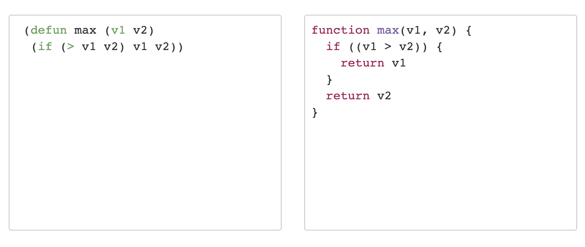

# lispToJS
Translator from lisp to JS (just for fun, or not?)

## Intro

This app is implemented in Node, so you need to install Node.js(preferably the latest version) and npm on your machine.

## Installation

```bash
git clone git@github.com:onfleet/guseyn-backend-homework.git
cd lispToJS
npm install
```

## Run

```bash
npm run start
```

You can open it on [http://localhost:8000/](http://localhost:8000/)

## Test

```bash
npm test
```

## Interface



Left editor is for typing in lisp. Right area is for JS code. JS area displays updates from backend as you type lisp code. But it does not update hightlighing of lisp code(because it slows down app), and you have to click somewhere outside of lisp editor to update highlighting of lisp code.

## Features

### Nested Lists

**lisp**
```lisp
(x (y (z) (a)))
```
**js**
```js
[x, [y, [z],
  [a]
]]
```

### Arithmetic Expressions

**lisp**
```lisp
(+ a (- b (* c (/ d e))) (+ f g) )
```
**js**
```js
(a + (b - (c * (d / e))) + (f + g))
```

### Variables Declaration (only local)

**lisp**
```lisp
(let ((var1 val1) (var2 val2)) ())
```
**js**
```js
let var1 = val1
let var2 = val2
```

### Function Declaration

**lisp**
```lisp
(defun name (v1 v2) (+ v1 v2))
```
**js**
```js
function sum(v1, v2) {
  return (v1 + v2)
}
```

### Function Call

**lisp**
```lisp
(defun sum (v1 v2) (+ v1 v2))(sum (10, 10))
```
**js**
```js
function sum(v1, v2) {
  return (v1 + v2)
}
sum(10, 10)
```

Only `format` function is supported by default. So, if you want to the system detect your functions you must declare them first.

### Loop (only this type)

**lisp**
```lisp
(loop for x in ("tom" "dick" "nina") do (format (t "~s" x)))
```

**js**
```js
for (let x in ['tom', 'dick', 'nina']) {
  format(t, '~s', x)
}
```

### Branches (only basic if)

**lisp**
```lisp
(if (< a 20) (format (t "~% a is less than 20")) (format(t "~% a is more than 20"))) 
```

**js**
```js
if ((a < 20)) {
  return format(t, '~% a is less than 20')
}
return format(t, '~% a is more than 20')
```

### Lambdas

**lisp**
```lisp
(lambda (x y) (+ x 10))
```

**js**
```js
(x, y) => {
  return (x + 10)
}
```

## Simple Example

### Max Of Two Vars

**lisp**
```lisp
(defun max (v1 v2) 
  (if (> v1 v2) v1 v2))
```

**js**
```js
function max(v1, v2) {
  if ((v1 > v2)) {
    return v1
  }
  return v2
}
````

## REST API

### /isValidLisp

**Request**

`POST` request with plain text body like `(defun max (v1 v2) (if (> v1 v2) v1 v2))`

**Possible Responses**

```json
{
    "isValid": true
}
```

```json
{
    "isValid": false
}
```
### /convertToJS

**Request**

`POST` request with plain text body like `(defun max (v1 v2) (if (> v1 v2) v1 v2))`

**Possible Responses**

```json
{
    "js": "function max(v1, v2) {\n  if ((v1 > v2)) {\n    return v1\n  }\n  return v2\n}"
}
```

```json
{
  "js": "Not Valid Lisp"
}
```
